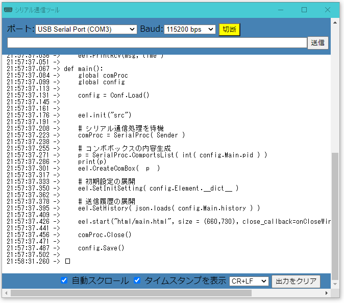

# SerialMonitor
pythonでシリアル通信を利用するGUIを作成するデモ

## コンセプト

* Arduino開発環境に付属のシリアルモニタをpythonで移植することで、
シリアル通信アプリを容易に作成する足がかりを作る。

* C#(Windows)版も作成したが、昨今MacやUbuntuといったLinuxの
需要も高まったため、Pythonで作成してみた。

* PythonにおけるGUIライブラリはいくつか存在するが、[Eel](https://github.com/ChrisKnott/Eel)を採用した。これはブラウザをエンジンとして、動作するHTMLやJavascriptを用いたGUI環境で、ウェブページの作例といった既存の高価な素材が揃っているため、流用が容易という理由で採用した。またGUI開発を容易にするため、[jQuery](https://jquery.com/)を利用している。

* シリアル通信部分は非同期で受信を待ち受ける必要があったため、Threadingを用いている。AsyncIOなどを利用したライブラリもあるとは
思うが、eelとの組み合わせて使用する例があまり見られなかったため、
今回はシンプルに実装してみた。機会があればそれらのライブラリの利用も検討したい。

* 設定値の保存はiniファイルフォーマットを利用している。
C#では[XMLSerializer](https://github.com/Soil-Y-paddy/PropertyGrid_Xml) を利用すれば、XMLファイルフォーマットで容易にクラスのプロパティへの展開が可能であるが、PythonではあまりXMLは流行っていないようだ。今回[Configparser](https://github.com/jaraco/configparser)のラッパークラスを作成し、Iniserializerrを開発した。

## SerialMonitor の使い方

基本的には、Arduinoのシリアルモニタと同様である。


<dl>
<dt>ポート</dt>
    <dd> 接続したいCOMポートを選択する。</dd>
<dt>Baud </dt>
    <dd> 通信速度を選択する。</dd>
<dt>[接続]ボタン</dt>
    <dd>押下すると、接続を開始し、[切断]ボタンになる。</dd>
<dt>テキストボックス</dt>
    <dd>送信したい文字列を入力する。送信すると、履歴が選択できる
    </dd>
<dt> [送信]ボタン</dt>
    <dd> 左のテキストボックスに入力された文字列を送信する。</dd>
<dt> 自動スクロール</dt>
    <dd> チェックを入れると、受信データに合わせてスクロールする。</dd>
<dt> タイムスタンプを表示</dt>
    <dd> チェックを入れるて場合、改行コードを受信後、次のデータが受信したときに、時間を表示する</dd>
<dt>改行コード</dt>
    <dd>送信ボタンを押したときの送信する文字列の末尾に追加される改行コードを選択する。</dd>
<dt>出力をクリア</dt>
    <dd>受信したデータ表示をクリアする</dd>




## ```SerialProc ```シリアル制御クラス

* シリアルポートを開き、受信待機用のスレッドを立ち上げる。

* 受信はreadlineを0.01秒毎にループで検出し、1バイト以上のデータを受信すると、コールバック関数で応答する。コールバック関数は受信データを文字列に *decode*したもの、及び改行コードを受信した場合タイムスタンプ、の２変数を返す。


* 送信は、受信用ループとは独立して行う。送信データは文字列を渡すとし、内部で*encode*を行っている。

* 送受信にはバッファを準備していない。例えば、指定のデータサイズや指定のバイトが受信されたら処理を行うといった制御は、上位層で行う必要がある。readlineによって、改行コードがあればその時点で返すようなので、応用は容易であろう。

* OSが認識しているCOMポート(Linuxの場合 */dev/tty*) の一覧を返すメソッドを準備した。昨今マザーボードに標準装備されたシリアルポートを利用する例はほぼ無く、たいてい **USB-Serial** 変換器を利用すると考えられるため、USBの**pid**を指定して該当のデバイスが利用可能な場合は選択状態になるように実装した。

### 基本的な使用方法
```python

from serialProc import SerialProc

onRecieve = False

def RecieveCallback( data, timestamp ):
    """ 引数： data : 受信データ(文字列)
           timestamp :  受信時間(HH:MM:SS.mm)"""
    global onRecieve
    print("{}->{}".format( timestamp, data ) )
    onRecieve = True

comProc = SerialProc( RecieveCallback )
comProc.Connect("COM3", 115200) # COMポートと、通信速度を指定
comProc.Transmit("Hwllow") # データ送信

while(1):
    if onRecieve :
        comProc.Close() # 受信したら閉じる
        break
    time.sleep(1)

```

## ```IniSerialize``` INIファイルシリアライザ

* configparserを用いて、クラス上のメンバ変数として利用できるように
　セッションとキーを展開する。

* [XMLSerializer](https://github.com/Soil-Y-paddy/PropertyGrid_Xml)を意識した実装を行っている。
すなわち、iniファイルが存在しない場合はデフォルト値を予め準備しておき、ファイルが存在し、読み込みが完了すればそれらの値を更新するという形をとっている。

* 読み込みはファイル名と、``` IniSerializer```を継承したユーザクラスを引数と持つスタティックメソッドで行う。

* 読み込みが完了すると、ユーザクラス内にセクション名を持つ ```IniSection```オブジェクトが生成される。

* ```IniSection``` オブジェクトはキー名からなるメンバ変数が並ぶ

* 各設定値を利用するには、```object["Section"]["key"]``` のような形式ではなく ```object.Section.key``` のようにアクセスできる。

### 基本的な使用方法

```python

from siniSerialize import IniSerializer, IniSection

class ClsA(IniSerializer):
    
    def __init__(self):
        """ デフォルト値を設定する"""
        """ キーと値は辞書形式で設定する"""
        self.TestSection = IniSection( {"TestKey1":123,"TestKey2":"Hellow"} )
        self.BlankSection =IniSection( )


c = IniSerializer.Load("test.ini", ClsA )
print(vars(c))

c.TestSection.TestKey1=100
c.TestSection.TestKey3 = "world"
setattr( c.TestSection, "Find", "you")

print(vars(c))


c.Save( "test.ini" )
```

書き込まれるiniファイルの例
```ini
[TestSection]
testkey1 = 100
testkey2 = Hellow
testkey3 = world
find = you

```